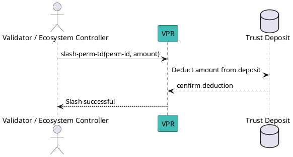
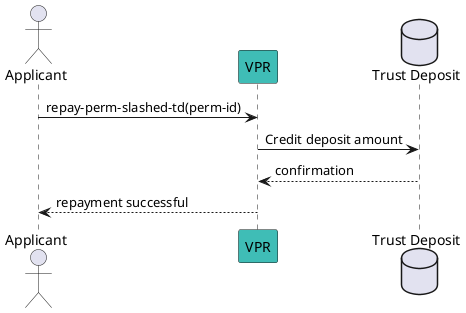

# Slash a Permission Deposit

## Perform a Permission Deposit Slash

The Trust Deposit linked to a Permission can be slashed by:

- the validator that granted the Permission;
- the Ecosystem Trust Registry controller (the `grantee` of the ECOSYSTEM permission of the Trust Registry).

**Syntax:**
```bash
veranad tx perm slash-perm-td <perm-id> <amount> --from <user> --chain-id <chain-id> --keyring-backend test --fees <amount> --gas auto
```

**Parameters:**
- `<perm-id>`: Numeric ID of the permission whose deposit you want to slash.
- `<amount>`: Amount to slash (must be less than or equal to the current deposit).

**Example:**
```bash
veranad tx perm slash-perm-td 42 1000000 --from $USER_ACC --chain-id $CHAIN_ID --keyring-backend test --fees 600000uvna --node $NODE_RPC
```

**Notes:**
- Only the validator that granted the permission or the Ecosystem controller can perform this action.
- The slashed amount is burned and cannot be recovered.
- Ensure sufficient transaction fees are available before executing.

### Slash Flow Diagram



## Repay a Permission Slashed Deposit

This method can only be called by anyone that want to repay the deposit of a slashed perm. This won’t make the perm re-usable: it will be needed for the `grantee` to request a new permission, as slashed permissions cannot be revived (same happen for revoked, etc…).

:::warning

To get a new permission for a given Ecosystem, it is needed, using this method, to **first repay the deposit of a slashed permission**.

:::

**Syntax:**
```bash
veranad tx perm repay-perm-slashed-td <perm-id> --from <user> --chain-id <chain-id> --keyring-backend test --fees <amount> --gas auto
```

**Example:**
```bash
veranad tx perm repay-perm-slashed-td 42 --from $USER_ACC --chain-id $CHAIN_ID --keyring-backend test --fees 600000uvna --node $NODE_RPC
```

**Notes:**
- Repaying the deposit does NOT reactivate the permission.
- This step is mandatory before requesting a new permission for the same schema.
- Ensure you have enough balance to cover the slashed amount and transaction fees.

### Repay Flow Diagram

