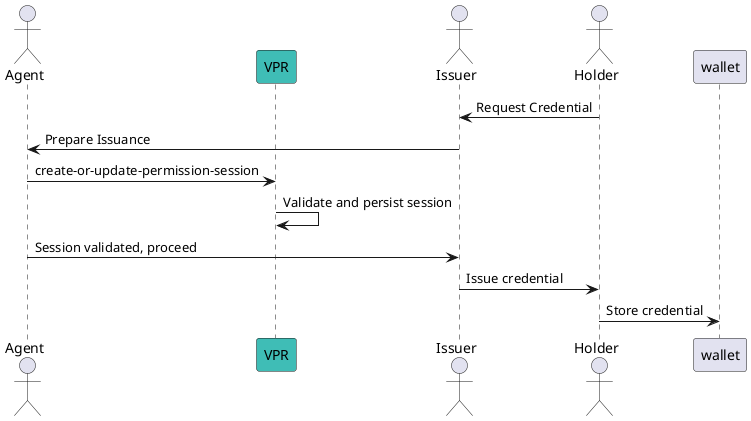
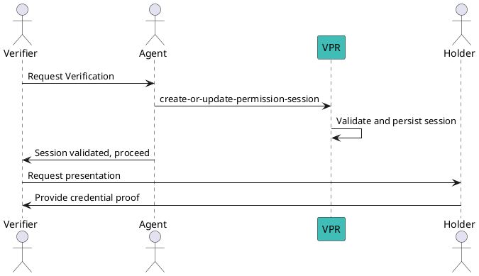

# Create or Update Permission Session

A **Permission Session** is required for credential exchange processes that involve **paying issuance or verification fees** according to the permission hierarchy. This session ensures correct fee distribution to all beneficiaries (e.g., Issuers, Verifiers, and Ecosystem controllers) and maintains trust deposit compliance.

---

## What is a Permission Session?

A Permission Session acts as a temporary authorization and accounting record that connects:

- The **agent** (Verifiable Service or Wallet) handling the request.
- The **issuer or verifier** performing the action.
- The **wallet agent** where the credential will be stored.

This session is referenced during issuance or verification to:

- Validate permissions.
- Calculate and transfer trust fees.
- Enforce trust deposit rules.

---

## When to Create or Update a Permission Session?

- **Issuance Flow:** Before an Issuer issues a credential to a Holder.
- **Verification Flow:** Before a Verifier requests presentation of a credential.

Without a valid session:
- The transaction **will fail** because trust fee distribution cannot be performed.
- The credential exchange cannot proceed.

---

## CLI Command

### Syntax
```bash
veranad tx perm create-or-update-permission-session <session-id> <agent-perm-id> <wallet-agent-perm-id> [issuer-perm-id] [verifier-perm-id] \
  --from <user> --chain-id <chain-id> --keyring-backend test --fees <amount> --gas auto
```

### Parameters
- `<session-id>`: A UUID that uniquely identifies the session.
- `<agent-perm-id>`: Permission ID of the agent handling the transaction (usually ISSUER).
- `<wallet-agent-perm-id>`: Permission ID of the wallet agent where the credential will be stored.
- `[issuer-perm-id]` (optional): Permission ID of the Issuer (required for issuance flows).
- `[verifier-perm-id]` (optional): Permission ID of the Verifier (required for verification flows).

---

## Examples

### 1. Issuance Session
```bash
SESSION_ID=$(uuidgen)
veranad tx perm create-or-update-permission-session $SESSION_ID 45 50 30 \
  --from $USER_ACC --chain-id $CHAIN_ID --fees 600000uvna --node $NODE_RPC
```
Explanation:
- `agent-perm-id` = 45 (Agent handling issuance).
- `wallet-agent-perm-id` = 50 (Wallet where credential will be stored).
- `issuer-perm-id` = 30 (Permission of the Issuer).

---

### 2. Verification Session
```bash
SESSION_ID=$(uuidgen)
veranad tx perm create-or-update-permission-session $SESSION_ID 45 50 "" 60 \
  --from $USER_ACC --chain-id $CHAIN_ID --fees 600000uvna --node $NODE_RPC
```
Explanation:
- `verifier-perm-id` = 60 (Permission of the Verifier).

---

## Workflow Diagram (Issuance)


---

## Workflow Diagram (Verification)


---

## Key Points
- Fees are calculated based on the **permission hierarchy** and **GlobalVariables**.
- Both issuance and verification sessions require a valid **agent** and **wallet agent** permission.
- Failure to create the session before the exchange will block the process.

For details on fee calculation and hierarchy, see [Permission Module Spec](https://verana-labs.github.io/verifiable-trust-vpr-spec/#permission-module).

