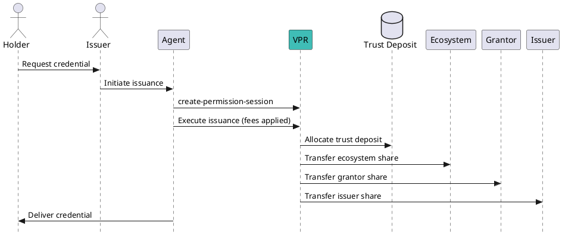

# Credential Issuance Guide

This guide explains how to issue Verifiable Credentials after successfully onboarding as an **Issuer**. It covers prerequisites, CLI commands, and how trust fee monetization works during issuance.

---

## Overview of the Issuance Process

Issuance in Verana follows these core steps:

1. **Ensure Issuer Permission**  
   - You must have an active **Issuer** permission for the relevant credential schema.
2. **Create a Permission Session**  
   - Required for fee distribution and trust compliance before issuance.
3. **Issue the Credential**  
   - Use your Agent or Wallet to perform the issuance flow.
4. **Verify Monetization Flow**  
   - Fees and trust deposits are automatically processed on-chain.

---

## Preconditions

- Issuer permission status: `VALIDATED` (see [Onboarding Guide](20-onboarding.md)).
- Registered DID for your Verifiable Service.
- Sufficient funds to cover:
  - Gas and transaction fees
  - Any additional trust deposits required for monetization

---

## Step 1: Create a Permission Session

Before issuance, create a **Permission Session** to enable correct fee distribution and enforce the trust model.

**Syntax:**
```bash
veranad tx perm create-or-update-perm-session <session-id> <agent-perm-id> <wallet-agent-perm-id> [issuer-perm-id] \
  --from <user> --chain-id <chain-id> --keyring-backend test --fees <amount> --gas auto
```

**Example:**
```bash
SESSION_ID=$(uuidgen)
veranad tx perm create-or-update-perm-session $SESSION_ID 45 \
  --issuer-perm-id 30 \
  --wallet-agent-perm-id 50 \
  --from $USER_ACC  --keyring-backend test --chain-id $CHAIN_ID --fees 600000uvna --node $NODE_RPC
```

Parameters:
- `session-id`: Unique identifier for this issuance session.
- `agent-perm-id`: The agent permission handling issuance.
- `--issuer-perm-id`: (Optional) The Issuer’s permission ID (must be set for issuance flows).
- `--wallet-agent-perm-id`: (Optional) The wallet agent where the credential will be stored (if different from the agent).

For detailed info, see [Create Permission Session](80-create-or-update-permission-session.md).

---

## Step 2: Issue the Credential

Issuance is typically performed via your Verifiable Service Agent or Wallet application using DIDComm or an API. At the blockchain level:
- The Permission Session ensures trust fees are applied.
- Issuance fees are deducted according to the permission hierarchy.

*(Note: Direct CLI issuance of credentials is not handled by `veranad`. Use an agent implementation or SDK.)*

---

## Fee Monetization and Trust Flow

When a credential is issued:
- **Issuance fee** (defined in the root permission) is split among:
  - **Ecosystem controller**
  - **Issuer Grantor** (if applicable)
  - **Agent and Wallet agents** (if configured)
- A portion of the fees is locked as a **trust deposit** per Global Variables and Ecosystem policy.

---

## Example Fee Flow Diagram



---

## Verification After Issuance

To verify that the issuance session and associated fees were applied:
```bash
veranad q perm list-permission-sessions --node $NODE_RPC --output json
```

Check:
- Session ID exists
- Linked permission IDs
- Status: `ACTIVE`

---


### Related Topics
- [Create Permission Session](80-create-or-update-permission-session.md)
- [Verification Guide](100-verification-guide.md)
- [Credential Monetization](../../learn/verifiable-public-registry/credential-monetization)

---

:::note
### Open Question: Execution of Issuance on VPR

The current specification diagrams and text reference a step labeled **"Execute issuance (fees applied)"**, suggesting an on-chain action performed by the Verifiable Public Registry (VPR). However, as of now:

- There is **no explicit CLI command** in `veranad` for "execute issuance."
- Actual credential issuance occurs **off-chain** via an Agent or Wallet using DIDComm or API flows.
- The blockchain role appears limited to **Permission Session creation** and **fee enforcement**.

**Gap / Ambiguity:**  
It is unclear whether the spec intends for an additional on-chain confirmation step (e.g., marking issuance complete) or whether the issuance process should remain entirely off-chain beyond session creation.

**Next Steps:**  
- Validate the intent with spec authors (e.g., Fabrice).
- Determine if a future command such as `veranad tx perm complete-session` is expected.
:::
