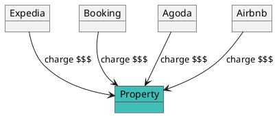
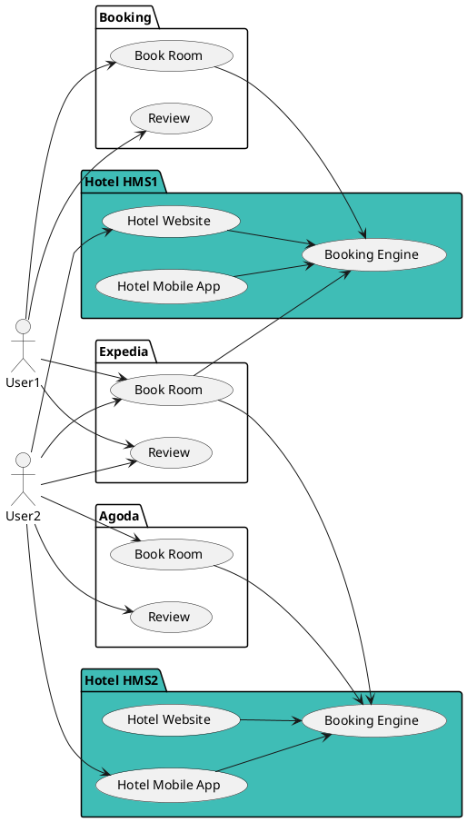
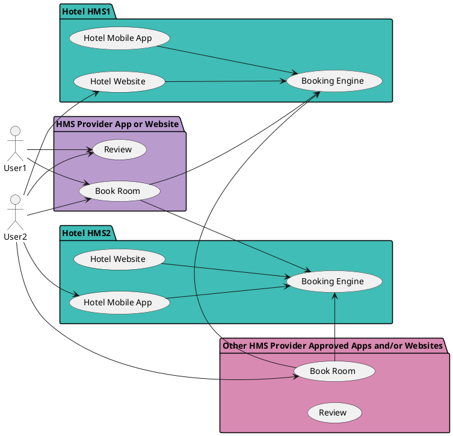

# Decentralizing Hotel Management with Verana

## The Problem: Hotel Discovery & Broker Domination

The hotel industry is a striking example of how centralization locks value.  

Today, nearly all hotel reservations happen through **brokering platforms** like **Booking.com**, **Expedia**, **Agoda**, or **Airbnb**. These intermediaries have achieved near-monopoly power, **capturing a huge share of hotel revenues** and indirectly **raising room costs for users**.  

Paradoxically, while users believe they’re saving money, they actually pay more, since hotels must increase their prices to cover broker fees.

👉 **If a hotel isn’t listed on broker platforms, it effectively doesn’t exist in the market.**

## Hotel Management Systems Today

To manage their properties, hotels often rely on **Hotel Management Systems (HMS)**, which may be **proprietary (SaaS)** or **open source** (self-hosted/cloud-hosted).

Open source HMS platforms are appealing because they:

- Allow hotels to host software anywhere, avoiding vendor lock-in.
- Ensure hotels own their data.
- Provide key open-source modules such as:
  - **Property Management System (PMS)**
  - **Booking Engine**
  - **Hotel Website Builder**
  - **Hotel Mobile App skeleton**

### Current Business Models of Open Source HMS

Most open-source HMS providers monetize via:

- Selling **software add-ons** (e.g., channel managers to sync with booking.com or Expedia).
- Offering **custom development services**.
- Providing **hosting solutions**.

These systems work well for **hotel management**, but **visibility is still dictated by brokers**. Even when hotels run their own websites/apps, most new customers still arrive via **brokers**.

## Enter Verana: Making Hotels Instantly Discoverable

Verana changes the game by **removing dependency on centralized brokers**.

### How Open Source HMS Providers Can Use Verana

Open Source HMS Providers can redefine their business models by adding the Verifiable Trust layer to their software. They just need to:

1. **Create a Hotel Ecosystem in Verana**

- Establish rules via an **Ecosystem Governance Framework (EGF)**.
- Create their Trust Registry and define a **Hotel Credential Schema** in Verana.

2. **Add Verifiable Trust to Open Source HMS Software**

- Integrate **Verana’s Verifiable Trust stack** into booking engines, PMS, and mobile apps.

3. **Launch a Verifiable User Agent**

- Build a **global mobile app or website** (the “HMS Provider App”) that serves as a **browser for verifiable hotels**.
- This app functions as a **broker competitor**, but **without extracting rents**.

### What Hotels Gain

Hotels using such an HMS automatically become:

- **Searchable** in the HMS Provider’s global app.
- **Bookable directly**, bypassing brokers.
- **Empowered** to interact with guests through verifiable credentials (e.g., for check-in, digital room access).

### What Guests Gain

- A **trustworthy, verifiable search experience**.
- The ability to **book directly with hotels** via the HMS Provider app.
- **Privacy-preserving interactions** where their identity and preferences are verified but never exploited.

## Why This Matters

- **For Hotels**: regain independence, stop paying excessive broker fees, own your data.
- **For Users**: enjoy lower prices, verified reviews, and more trust in bookings.
- **For HMS Providers**: compete with global brokers by offering open, decentralized visibility.
- **For the Internet**: Verana delivers a **public-good trust layer**, shifting value back to participants instead of intermediaries.

## Conclusion

The hotel industry doesn’t need to be trapped by centralized brokers. By using **Verana’s decentralized trust infrastructure**, Hotel Management Systems can:

- Make hotels **instantly visible** without intermediaries.
- Enable **trustworthy, credential-based interactions** between hotels and guests.
- Create a **privacy-preserving, fair economic model** where value stays with hotels and users.

👉 With Verana, hotels can finally say:
“**We own our reservations, our reputation, and our data.**”
